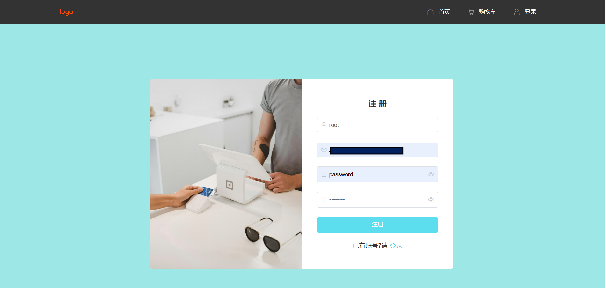
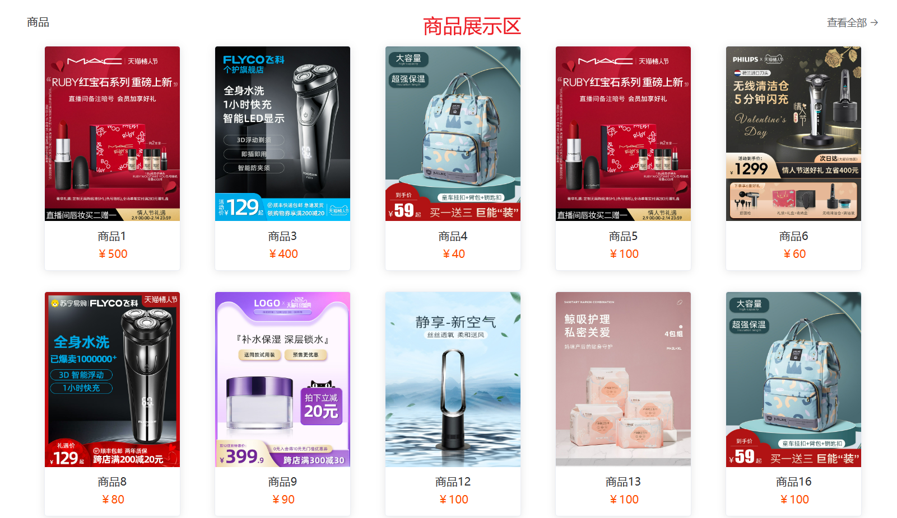
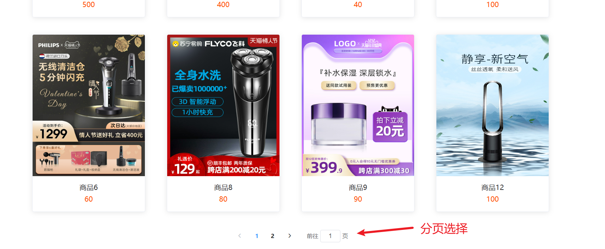
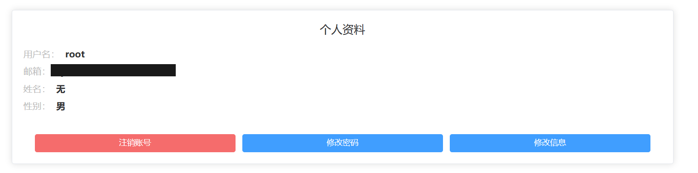
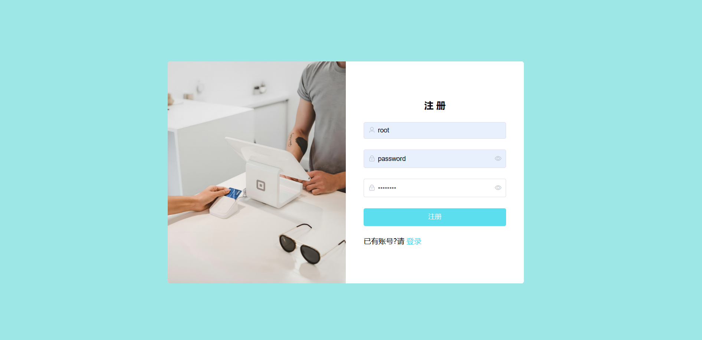
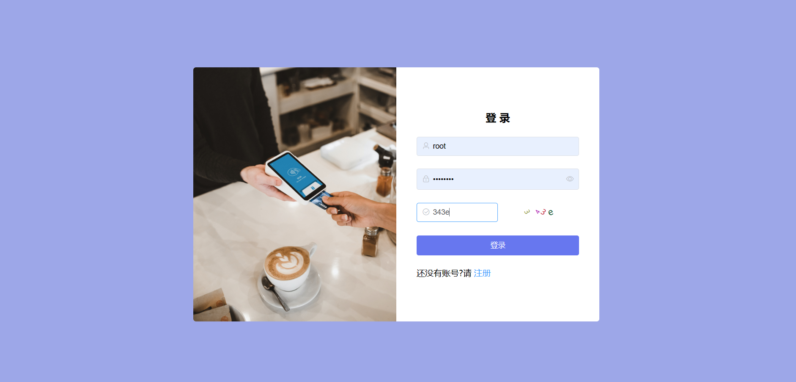
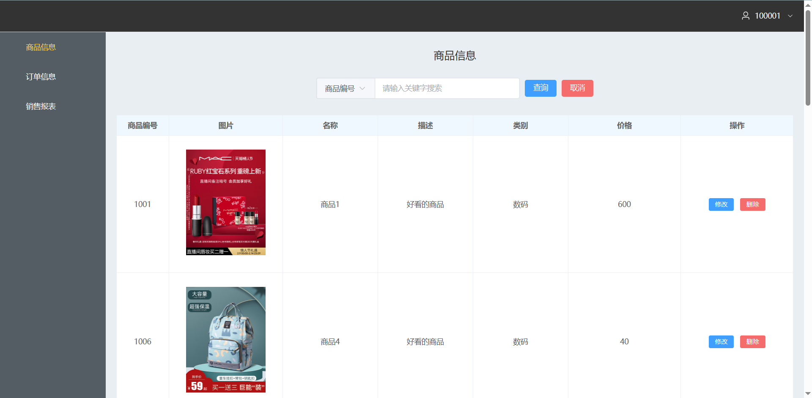
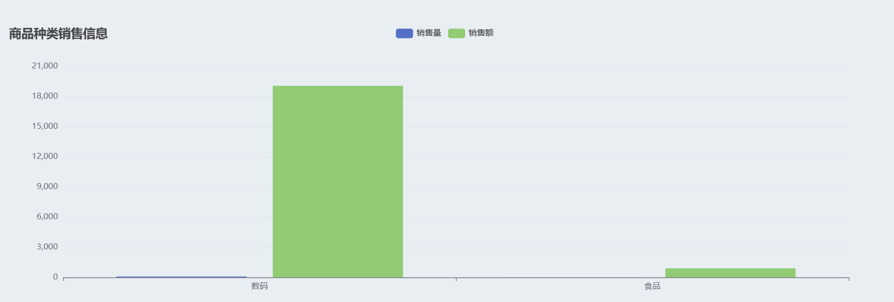

# Online_shop

**本项目为基于JavaWeb的电子商务网站，采用vue+springboot+mysql的前后端分离的开发架构。**

学号：202130440439  姓名：翟彦


## 一、测试参数

1. 顾客
   1. 网址：http://8.134.116.81:7000/
   2. 测试账户
      - 用户名：root
      - 密码：password
2. 销售
   1. 网址：http://8.134.116.81:7001/
   2. 测试账户
      - 用户名：root
      - 密码：password


## 二、项目说明

1. 项目结构介绍

   

2. 后端项目结构介绍

   

3. 前端项目结构介绍（以销售界面为例）

   

   


## 三、部分代码说明

### 一、后端

1. 解决跨域请求的配置文件（disposition/CorsConfig）

   ```java
   @Configuration
   public class CorsConfig{
   
       // 当前跨域请求最大有效时长。这里默认1天
       private static final long MAX_AGE = 24 * 60 * 60;
   
       @Bean
       public CorsFilter corsFilter() {
           UrlBasedCorsConfigurationSource source = new UrlBasedCorsConfigurationSource();
           CorsConfiguration corsConfiguration = new CorsConfiguration();
           corsConfiguration.addAllowedOrigin("*"); // 1 设置访问源地址
           corsConfiguration.addAllowedHeader("*"); // 2 设置访问源请求头
           corsConfiguration.addAllowedMethod("*"); // 3 设置访问源请求方法
           corsConfiguration.setMaxAge(MAX_AGE);
           source.registerCorsConfiguration("/**", corsConfiguration); // 4 对接口配置跨域设置
           return new CorsFilter(source);
       }
   }
   ```

2. 登录校验的令牌生成与解析文件（utility/JwtUtils）

   ```java
   public class JwtUtils {
       //令牌持续时间为24小时
       private static Date expireDate = new Date(System.currentTimeMillis() + 24*3600*1000);
       //加密协议
       private static String SECRET = "iuhuhknhuyguygnomnojmoijuhuygtyftyfytguoyguygtf";
   
       //生成jwt令牌
       public static String generateJWT(Map<String, Object> claims)
       {
           String token=Jwts.builder()
                   .addClaims(claims)
                   .signWith(SignatureAlgorithm.HS256, SECRET)
                   .setExpiration(expireDate)
                   .compact();
           return token;
       }
   
       //解析jwt令牌
       public static Claims parseJWT(String token)
       {
           Claims claims=Jwts.parser()
                   .setSigningKey(SECRET)
                   .parseClaimsJws(token)
                   .getBody();
           System.out.println(claims);
           return claims;
       }
   }
   ```

3. 过滤器（filter）的设置（utility/LoginCheckFilter）

   ```java
   @WebFilter(urlPatterns = "/*")
   public class LoginCheckFilter implements Filter {
   
       @Value("${ip:localhost}")
       String ip;
   
       @Value("${server.port}")
       String port;
   
       @Override //拦截到请求调用，调用多次
       public void doFilter(ServletRequest servletRequest, ServletResponse servletResponse, FilterChain filterChain) throws IOException, ServletException {
           HttpServletRequest req = (HttpServletRequest) servletRequest;
           HttpServletResponse res = (HttpServletResponse) servletResponse;
           //获取url
           String url = req.getRequestURL().toString();
   
           //解决跨域问题
           res.setHeader("Access-Control-Allow-Origin", "*");
           res.setHeader("Access-Control-Allow-Methods", "GET,POST,PUT,DELETE,OPTIONS");
           res.setHeader("Access-Control-Allow-Headers", "Content-Type,token");
   
           //处理预检请求
           if(req.getMethod().equals("OPTIONS"))
           {
               res.setStatus(HttpServletResponse.SC_OK);
               return;
           }
   
           //如果是登录或者注册请求则放行
           if (url.equals("http://"+ip+":"+port+"/login") | url.equals("http://"+ip+":"+port+"/register")
                   | url.equals("http://"+ip+":"+port+"/managerlogin")| url.equals("http://"+ip+":"+port+"/managerregister")
                   | url.equals("http://"+ip+":"+port+"/goodsshow") | url.startsWith("http://"+ip+":"+port+"/download/")) {
               filterChain.doFilter(servletRequest, servletResponse);
               return;
           }
   
           //获取请求头中的令牌
           String token = req.getHeader("token");
           System.out.println(token);
   
           //如果用户为未登录
           if (!StringUtils.hasLength(token))
           {
               System.out.println("用户未登录");
               Result error=Result.error("NO_LOGIN");
               //将对象转换为json文件并返回
               String str=JSONObject.toJSONString(error);
               res.getWriter().write(str);
               return;
           }
           else
           {
               try
               {
                   JwtUtils.parseJWT(token);
                   System.out.println("验证成功");
               } catch (Exception e) {
                   System.out.println("验证错误");
                   Result error=Result.error("NO_LOGIN");
                   //将对象转换为json文件并返回
                   String str=JSONObject.toJSONString(error);
                   res.getWriter().write(str);
                   return;
               }
           }
   
           //放行
           System.out.println("已登录");
           filterChain.doFilter(servletRequest, servletResponse);
       }
   }
   ```


### 二、前端

1. 请求信息的配置（utility/request.js)

   ```js
   import axios from "axios";
   
   //创建一个新的axios对象
   const request=axios.create({
       baseURL:process.env.VUE_APP_BSAEURL, //后端的ip地址
       timeout:30000 //响应时间
   })
   
   // request拦截器
   // 可以在请求发送前对请求做一些处理
   request.interceptors.request.use(config=>{
       config.headers['Content-Type']='application/json;charset=utf-8';
       //获取浏览器中存储的令牌
       let token=JSON.parse(localStorage.getItem("managertoken"))
       if(token)
       {
           //让发送请求中携带令牌
           config.headers['token']=token
       }
       return config
   },error => {
       console.log('request error'+error)
       return Promise.reject(error)
   })
   
   //response拦截器
   request.interceptors.response.use(response=>{
       //res即前面的result.data
       let result=response.data
       if(typeof result==='string')
       {
           result=result?JSON.parse(result):result
       }
       return result
   },error => {
       console.log('response error'+error)
       return Promise.reject(error)
   })
   
   export default request
   ```

2. 项目端口即发送配置（vue.config.js）

   ```js
   const { defineConfig } = require('@vue/cli-service')
   module.exports = defineConfig({
     transpileDependencies: true,
     devServer:{
       //配置界面使用的端口号
       port:7001,
       //配置发送请求的ip地址
       proxy: {
         '/api': {
           target: process.env.VUE_APP_BSAEURL,
           changeOrigin: true
         }
       }
     }
   })
   ```


## 四、功能展示

### 一、顾客界面

1. 用户注册，顾客在进行页面操作之前，需要先注册一个账号（若已有账号可直接登录），邮箱请设置为自己的邮箱，用于接收订单信息。

   

2. 用户登录，在用户注册了账号之后可以进行登录。

   

3. 导航栏交互，在顶部的导航栏中，可以点击首页按钮回到主界面，也可以点击购物车按钮进入购物车界面进行商品的结算购买，也可以通过用户的下拉菜单进行查看个人中心，订单信息以及退出登录等一系列操作。

   

4. 主页交互，可从轮播图左侧的菜单栏或是下方主页商品展示区的查看全部进入商品展示页，也可以直接点击下方商品展示区的商品图片进入商品详情页，进行下一步操作。

   

   

5. 商品展示页交互，在商品展示页中会展示所有的商品，由于使用了分页功能，于是每页中只会展示8件商品，用户可以通过下方的分页按钮来进行页面的切换，当点击商品的图片时，会跳转到商品详情页以进行下一步的操作。

   

6. 商品详情页交互，在商品详情页中，可以看到商品的名称，描述以及商品的价格，并且可以在下方看到商品的详情介绍图（为了节约工作，该图为系统默认），除了商品的基本信息展示，可以在该界面中进行商品的添加购物车以及立即购买操作，其中立即购买选项在将商品添加到购物车的同时还会直接跳转到购物车页面，节省用户操作时间。

   

7. 购物车界面交互，在购物车界面中，会展示顾客所有加入购物车的商品，右下方则显示顾客当前选中商品的总数以及总价，当用户选择了需要购买的商品后点击提交订单并确认即可完成购买，购买成功后会有订单信息发送到顾客注册时使用的邮箱（可在个人中心修改）上。

   

8. 个人中心界面交互，在个人中心中，可以查看个人的相关资料，并且可以在这个界面中进行修改用户信息，密码以及注销账号的操作，其中修改密码和注销账号均需要输入原有密码，若注销账号后该账号的所有信息包括订单信息也会全部被删除。

   

9. 订单信息界面交互，在这个界面中，顾客可以查看自己已完成的订单，并且支持删除订单操作。

   


### 二、销售界面

1. 注册界面，销售的账号仅作为登录验证使用，不包含额外信息的添加。

   

2. 登录界面，用于登录销售的账号

   

3. 商品信息界面交互，在这个界面中，销售可以进行商品的添加、修改与删除等操作，同时商品编号作为商品的唯一标识符，不可重复和修改，只允许在添加商品时设置，同时销售人员可以通过表格上方的搜索栏通过商品编号搜索指定的商品。

   

4. 订单信息界面交互，在该界面中，销售可以看到所有用户的订单信息，并且可以通过上方的搜索栏输入用户的用户名来显示指定用户的订单信息。

   

5. 销售报表信息界面交互，在该界面中，销售人员可以看到每天销售情况的统计，包括当天的用户购买次数，用户购买的商品总数以及购买总价即当天的销售额，并且在该界面的下方还有图表显示，可以让销售员更直观地观察每天销售额的变化。

   

   


## 五、注意事项

1. 顾客的用户名是唯一的，无法更改与同名，仅在注册时可设置，其余信息包括邮箱、密码等均可后续在个人中心中更改。销售的用户名也是唯一的，但销售的账户仅做登录验证使用，无法修改信息，但是可注销。
2. 登录验证的有效期是 **24** 小时，超过24小时候需要重新登录。
3. 服务器的运行日期为从 **2023/12/9** 开始的三个月，超出这段时间后网站将无法被访问，直到将来再配置服务器。
4. 商品的编号作为商品的唯一标识符，无法重复和被修改，仅可在添加商品时设置。
5. 商品的图片为商品的主展示图，其余的相关图片，例如顾客界面的商品详情页中的轮播图和详情图均为系统默认。
6. 顾客界面主页的轮播图仅为展示用，无法进行页面跳转，且轮播区左侧的菜单栏的跳转连接均为统一界面。
7. 首次操作顾客界面进入购物车界面的时候可能会有些许的卡顿，可以先切去其它界面再切回来或者刷新界面。
8. 在界面加载商品图片遇到加载不出来的问题时，可以选择等待一会或是刷新界面来解决。
